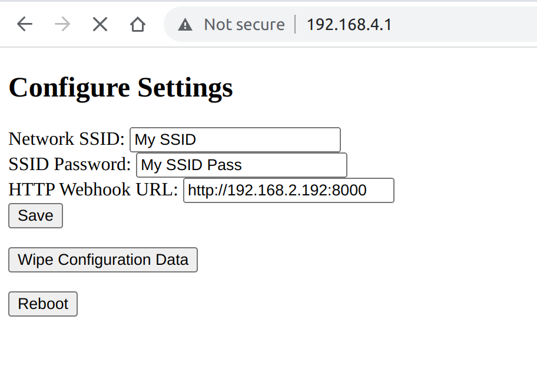

# bluey-lite
A Bunch of builds/forks of the tilt hydrometer companion for different micro controllers

Currently Right now that is only the `t-picoc3`. If I do more they will be split into subdirectories

T-PicoC3
========

For more detailed information [visit my blog post](https://marcyoung.us/post/tilt-hydrometer-on-a-tpicoc3/)

## Installation

### The Easy Way

TODO

### The Hard Way

RP2040 Side (golang - handles the TFT)

* Plug in the picoc3 on the RP2040 side
* Set the pi to flashable by holding boot, press run, let go of boot
* Grab the binary from this repo releases or build this one with [tinygo](https://tinygo.org/getting-started/install/linux/): `$ tinygo build -target=pico -o bluey.uf2 main.go`
* Install [picotool](https://github.com/raspberrypi/picotool)
* `$ picotool load -x bluey.uf2`

ESP32 side (WIFI + BLE to RP2040 via UART)

* Plug in the esp32-c3 side
* Set it to bootloader mode by jumping IO9 to GND
* Install [esptool](https://github.com/espressif/esptool)
* Erase it: `$ esptool.py --chip esp32c3 --port /dev/ttyACM0 erase_flash #note your USB port and use that`
* Download [micropython for esp32-c3](https://micropython.org/resources/firmware/esp32c3-usb-20220618-v1.19.1.bin)
* Flash it with micropython: `$ esptool.py --chip esp32c3 --port /dev/ttyACM0 --baud 460800 write_flash -z 0x0 esp32c3-usb-20220618-v1.19.1.bin`
* Install [thonny](https://thonny.org/)
* Download [this helpful urequests file](https://raw.githubusercontent.com/pfalcon/pycopy-lib/master/urequests/urequests/__init__.py). Open it in thonny, save it to micropython on the esp32-c3 as `urequests.py`.
* Download [Microdot.py](https://github.com/miguelgrinberg/microdot/blob/main/src/microdot.py). This is for the captive portal for configuration.
* Download the main.py file here and save it as `main.py` on the esp32-c3
  * Make changes to connect to your wifi network
  * Make changes (if wanted) to send BLE tilt data to a webserver

## Configuration

While (or right after) plugging in the device, hold the button labeled IO7
The t-pico will spin up an AP named 'Bluey' that you can wirelessly connect to. You can then browse to http://192.168.4.1 and configure it.
This information is printed on the LCD screen as well.

You should be good to go!

Happy hacking
